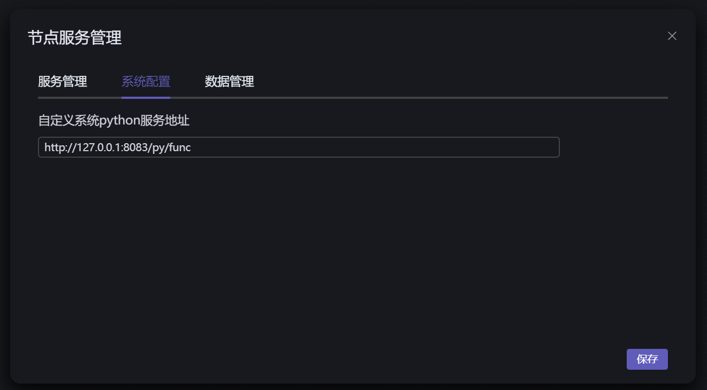

# 说明

软件可以配置自定义系统python，这样在编辑节点时，节点函数的python代码将使用自定义系统python来执行。用户就可以pip各种库，使用自己的python环境来写节点了。

## 使用方式

### 1.安装

```shell
pip install pyfineflow -U
```

::: tip
pyfineflow一直在更新，请使用 -U的方式更新为最新的版本
:::

### 2.配置

命令行执行pyfineflow命令

```shell
pyfineflow
```

出现如下结果：
```shell
pyfunc_server_url:  http://127.0.0.1:8083/py/func
INFO:     Started server process [18280]
INFO:     Waiting for application startup.
INFO:     Application startup complete.
INFO:     Uvicorn running on http://127.0.0.1:8083 (Press CTRL+C to quit)
```
如上：pyfunc_server_url:  http://127.0.0.1:8083/py/func

然后在**系统设置**->**系统配置**配置上述地址：


点击保存即可。